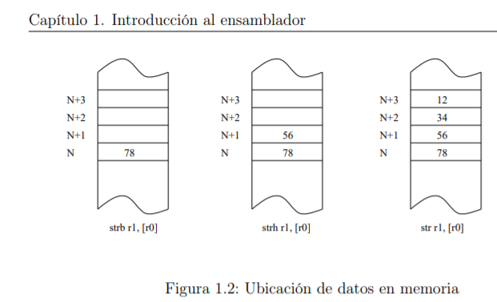
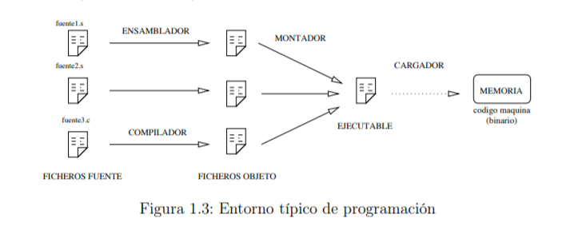

# 1.1.1. Características generales de la arquitectura ARM
ARM es una arquitectura RISC (Reduced Instruction Set Computer=Ordenador
con Conjunto Reducido de Instrucciones) de 32 bits, salvo la versión del core ARMv8-
A que es mixta 32/64 bits (bus de 32 bits con registros de 64 bits). Se trata de una
arquitectura licenciable, quiere decir que la empresa desarrolladora ARM Holdings
diseña la arquitectura, pero son otras compañías las que fabrican y venden los chips,
llevándose ARM Holdings un pequeño porcentaje por la licencia.
# Registros
La arquitectura ARMv6 presenta un conjunto de 17 registros (16 principales más
uno de estado) de 32 bits cada uno.
# Esquema de almacenamiento

# 1.1.2. El lenguaje ensamblador
El ensamblador es un lenguaje de bajo nivel que permite un control directo de
la CPU y todos los elementos asociados. Cada línea de un programa ensamblador
consta de una instrucción del procesador y la posición que ocupan los datos de esa
instrucción.
# 1.1.3. El entorno

# 1.1.5. Aspecto de un programa en ensamblador
```bash
.data
var1 : .word 3
var2 : .word 4
var3 : .word 0x1234
.text
.global main
main : ldr r1, puntero_var1 /* r1 <- & var1 */
ldr r1, [ r1 ] /* r1 <- *r1 */
ldr r2, puntero_var2 /* r2 <- & var2 */
ldr r2, [ r2 ] /* r2 <- *r2 */
ldr r3, puntero_var3 /* r3 <- & var3 */
add r0, r1, r2 /* r0 <- r1 + r2 */
str r0, [ r3 ] /* *r3 <- r0 */
bx lr
puntero_var1 : .word var1
puntero_var2 : .word var2
puntero_var3 : .word var3
```
# Datos
Los datos se pueden representar de distintas maneras. Para representar números
tenemos 4 bases. La más habitual es en su forma decimal, la cual no lleva ningún
delimitador especial. Luego tenemos otra muy útil que es la representación hexadecimal, que indicaremos con el prefijo 0x

# Símbolos
Como las etiquetas se pueden ubicar tanto en la sección de datos como en la de
código, la versatilidad que nos dan las mismas es enorme. En la zona de datos, las
etiquetas pueden representar variables, constantes y cadenas. En la zona de código
podemos usar etiquetas de salto, funciones y punteros a zona de datos.

# Directivas
Las directivas son expresiones que aparecen en el módulo fuente e indican al
compilador que realice determinadas tareas en el proceso de compilación. Son fácilmente distinguibles de las instrucciones porque siempre comienzan con un punto.

# 1.2. Enunciados de la práctica
# Enteros y naturales
```bash
data
var1 : .byte 0b00110010
.align
var2 : .byte 0b11000000
.align
text
.global main
main : ldr r1, = var1 /* r1 <- & var1 */
ldrsb r1, [ r1 ] /* r1 <- *r1 */
ldr r2, = var2 /* r2 <- & var2 */
ldrsb r2, [ r2 ] /* r2 <- *r2 */
add r0, r1, r2 /* r0 <- r1 + r2 */
bx lr
```
# Instrucciones lógicas
```bash
text
.global main
main : mov r2, # 0b11110000 /* r2 <- 11110000 */
mov r3, # 0b10101010 /* r3 <- 10101010 */
and r0, r2, r3 /* r0 <- r2 AND r3 */
orr r1, r2, r3 /* r1 <- r2 OR r3 */
mvn r4, r0 /* r4 <- NOT r0 */
mov r0, # 0x80000000
tst r0, # 0x80000000
tst r0, # 0x40000000
bx lr
```
# Rotaciones y desplazamientos
```bash
.data
var1 : .word 0x80000000
.text
.global main
main : ldr r0, = var1 /* r0 <- & var1 */
ldr r1, [ r0 ] /* r1 <- *r0 */
LSRs r1, r1, #1 /* r1 <- r1 LSR #1 */
LSRs r1, r1, #3 /* r1 <- r1 LSR #3 */
ldr r2, [ r0 ] /* r2 <- *r0 */
ASRs r2, r2, #1 /* r2 <- r2 ASR #1 */
ASRs r2, r2, #3 /* r2 <- r2 ASR #3 */
ldr r3, [ r0 ] /* r3 <- *r0 */
RORs r3, r3, # 31 /* r3 <- r3 ROL #1 */
RORs r3, r3, # 31 /* r3 <- r3 ROL #1 */
RORs r3, r3, # 24 /* r3 <- r3 ROL #8 */
ldr r4, [ r0 ] /* r4 <- *r0 */
msr cpsr_f, #0 /* C=0 */
adcs r4, r4, r4 /* rotar izda carry */
adcs r4, r4, r4 /* rotar izda carry */
adcs r4, r4, r4 /* rotar izda carry */
msr cpsr_f, # 0x20000000 /* C=1 */
adcs r4, r4, r4 /* rotar izda carry */
bx lr
```
# Instrucciones de multiplicación
```bash
.data
var1 : .word 0x12345678
var2 : .word 0x87654321
var3 : .word 0x00012345
.text
.global main
main : ldr r0, = var1 /* r0 <- & var1 */
ldr r1, = var2 /* r1 <- & var2 */
ldr r2, = var3 /* r2 <- & var3 */
ldrh r3, [ r0 ] /* r3 <- baja (* r0) */
ldrh r4, [ r1 ] /* r4 <- baja (* r1) */
muls r5, r3, r4 /* r5 <- r3*r4 */
ldr r3, [ r0 ] /* r3 <- *r0 */
ldr r4, [ r1 ] /* r4 <- *r1 */
umull r5, r6, r3, r4 /* r6:r5 <- r3*r4 */
smull r5, r6, r3, r4 /* r6:r5 <- r3*r4 */
ldrh r3, [ r0 ] /* r3 <- baja (* r0) */
ldr r4, [ r2 ] /* r4 <- *r2 */
smulwb r5, r3, r4 /* r5 <- r3* baja (r4) */
smultt r5, r3, r4 /* r5 <- alta (r3 )* alta (r4)*/
```
