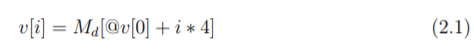
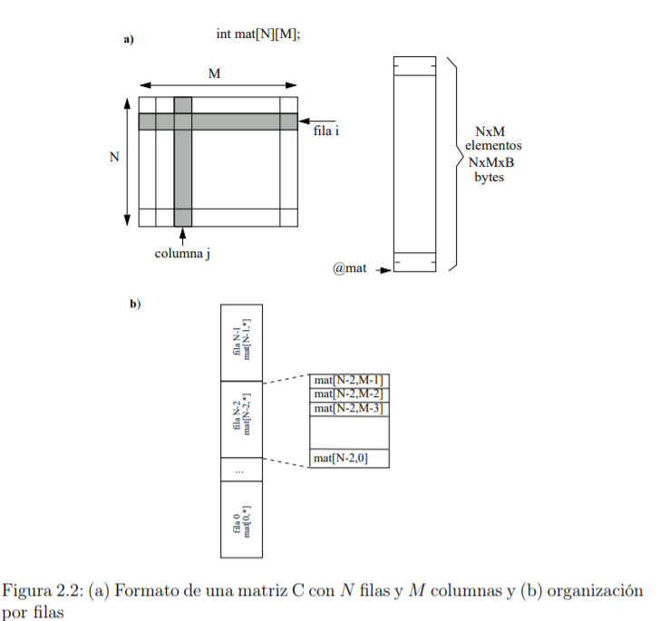

# 2.1.1. Modos de direccionamiento del ARM
En la arquitectura ARM los accesos a memoria se hacen mediante instrucciones
específicas ldr y str (luego veremos las variantes ldm, stm y las preprocesadas push y pop). El resto de instrucciones toman operandos desde registros o valores inmediatos, sin excepciones. En este caso la arquitectura nos fuerza a que trabajemos de un modo determinado: primero cargamos los registros desde memoria, luego procesamos el valor de estos registros con el amplio abanico de instrucciones del ARM, para finalmente volcar los resultados desde registros a memoria.
# 2.1.2. Tipos de datos
# Tipos de datos básicos.
En la siguiente tabla se recogen los diferentes tipos de datos básicos que podrán aparecer en los ejemplos, así como su
tamaño y rango de representación.
# Punteros. 
Un puntero siempre ocupa 32 bits y contiene una dirección de memoria.
En ensamblador no tienen tanta utilidad como en C, ya que disponemos de registros
de sobra y es más costoso acceder a las variables a través de los punteros que directamente. En este ejemplo acceder a la dirección de var1 nos cuesta 2 ldrs a través
del puntero, mientras que directamente se puede hacer con uno sólo.
# Vectores.
Todos los elementos de un vector se almacenan en un único bloque de
memoria a partir de una dirección determinada. Los diferentes elementos se almacenan en posiciones consecutivas, de manera que el elemento i está entre los i-1 e
i+1 (figura 2.1). Los vectores están definidos siempre a partir de la posición 0.

# Matrices bidimensionales.
Una matriz bidimensional de N×M elementos se almacena en un único bloque de memoria. Interpretaremos una matriz de N×M como
una matriz con N filas de M elementos cada una. Si cada elemento de la matriz
ocupa B bytes, la matriz ocupará un bloque de M ×N ×B bytes.
# 2.1.3. Instrucciones de salto

# 2.1.4. Estructuras de control de alto nivel
```bash
Listado 2.1: Estructura del for y while en C

int vi , vf , i ;
for ( i= vi ; i <= vf ; i ++ ){
/* Cuerpo del bucle */
}
i= vi ;
while ( i <= vf ){
/* Cuerpo del bucle */
i ++;
}
```
