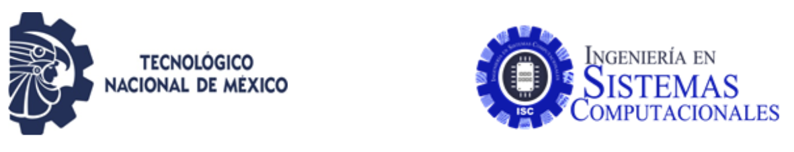

# 2.1-Lectura-Ejercicios

#    Tecnológico Nacional de México
#   Instituto Tecnológico de Tijuana
#        Subdirección Académica

# Departamento de Sistemas y Computación
# Ingeniería en Sistemas Computacionales
# Lenguajes de interfaz 

# Practica Bloque: 2.2
# Objetivo: Lectura y ejercicios de ARM32 del ebook OpenSource

# Estrada Gallegos Luis Humberto 17211520
   

# Profesor:
# MC. René Solis Reyes
# Semestre sep - ene 2020
